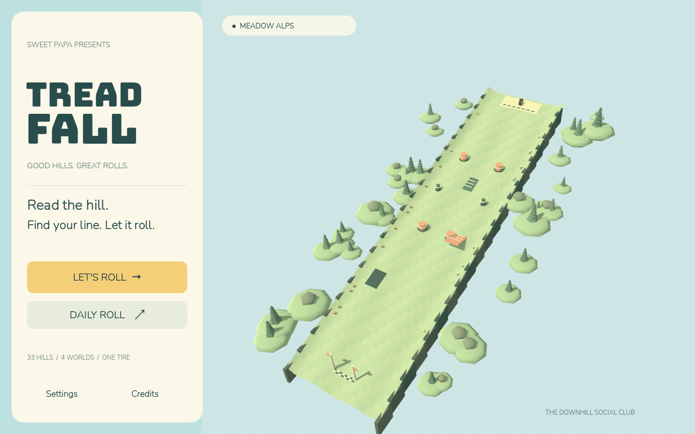
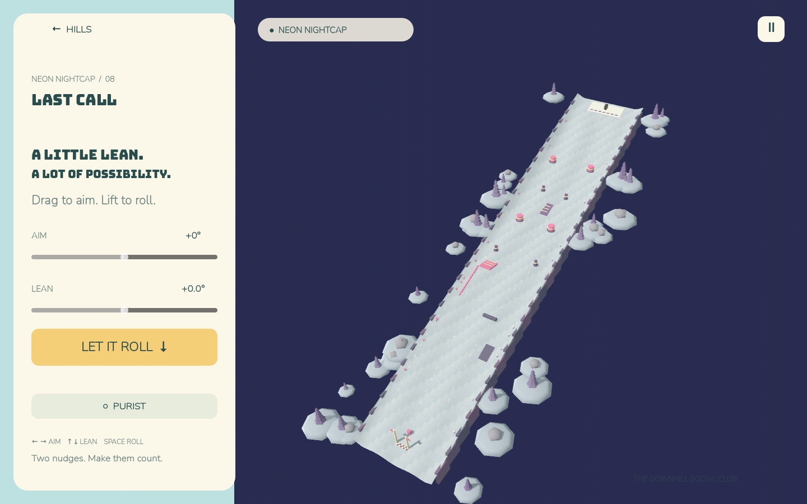

# TREADFALL

A native pastel downhill tire game. Read the hill, pick a line, lean a little, and let it roll.

**Playable alpha, built with Godot 4.7.2 + Jolt at 120 Hz, Mobile renderer.** Includes the complete title → course select → aim → roll → result → retry loop, 32 courses plus a tutorial, four worlds, four unlockable tires, daily rolls, local progress, settings, adaptive music and sound, and portrait/landscape layouts.

This is not a spec-complete store release. See [FEATURE_STATUS.md](FEATURE_STATUS.md) for the remaining implementation and release gates, and [MILESTONE.md](MILESTONE.md) for measured results.

## Play

On this machine, open `build/macos/TREADFALL.app`, or install from the **notarized, stapled** `build/macos/TREADFALL.dmg`. The source project also runs directly:

```sh
./tools/bootstrap.sh          # macOS: pinned editor + official export templates
./tools/godot                 # play
./tools/godot --editor        # edit
```

On other systems, install the pinned Godot version and set `GODOT_BIN` to its executable. No package manager, runtime download, account, or network connection is needed by the game itself.

- Drag horizontally on the hill to aim and vertically to lean; release to launch.
- The two sliders and **Let it roll** offer a precise alternative.
- During the roll, swipe left/right or use the nudge buttons. Two nudges, 0.5 s cooldown; a third attempt triggers TILT.
- Keyboard: **←/→** or **A/D** aim/nudge; **↑/↓** or **W/S** lean; **Space/Enter** roll/retry; **R** retry; **Esc** pause.
- Purist disables nudges and awards three stars on a clear. Earn four stars in a world to open the next. Tires unlock at 0/3/8/16 total stars.

## Verify

```sh
./tools/test.sh               # asset ledger, units, real UI events, 20 runtime retries,
                             # plus 20 physics repeats in each of 3 fresh processes
./tools/test.sh --full        # also 33 × 21 × 7 × 5 actual Jolt rolls + PNG heatmaps
./tools/godot -- --test --playtest
./tools/godot -- --test --perf # uncapped heaviest-course benchmark; exit fails above 16.6 ms p95
./tools/godot --headless --script tools/bake_course.gd -- meadow/01
```

`--test` keeps the real save untouched. Reports and screenshots go in `build/`; this folder is excluded from git and exports. The solver fails on impossible hills, >60% clear rate, or a roll reaching 20 s. Rolls still moving at 16 s end as misses. The solver uses the actual `RollingTire` scene behavior, not the reduced aim preview model.

Testing entry points:

```sh
./tools/godot -- --course coral/04 --state aim --seed 42 --aim 0.3 --lean -5
./tools/godot -- --course neon/08 --state roll --seed 42
./tools/godot --resolution 450x800 -- --state aim
```

The optional baker writes an editable grayscale PNG and a terrain mesh/collider scene to `build/baked`. Feed its PNG back as a second argument to verify a round trip. Current shipped hills use the analytic low-poly heightfield at runtime; integrating an edited bake into production course metadata is a content-authoring follow-up.

## Build and sign

```sh
./tools/export.sh macOS 0.1.0
./tools/sign-macos.sh build/macos/TREADFALL.app --dry-run
./tools/sign-macos.sh build/macos/TREADFALL.app --dmg
./tools/export.sh iOS 0.1.0
./tools/ios-simulator.sh
./tools/export.sh Windows 0.1.0
```

Godot and templates must both be **4.7.2**. `tools/export.sh` records the git commit, build count, version and SHA-256. It verifies packaged bytes, including an observed Godot export issue that produced a zero-byte macOS executable: the verifier restores the byte-identical official universal release binary and fails if that binary is invalid. A successful engine exit alone is not treated as a working app.

The signing scripts were reused from `~/code/FloppyJam/scripts`, as required. `FoFoPedal` and `FoFoSoundBooster` were absent; the available `FoFoPedalVST` setup was inspected. Credentials stay in the existing keychain/environment. `--dry-run` signs and verifies locally; it does **not** notarize. The second macOS command submits to Apple's notarization service and produces a stapled DMG. Windows Trusted Signing requires a Windows host, as in FloppyJam.

The iOS export is an Xcode project for `com.sweetpapa.treadfall`, team `6Y5SZ2K5XY`. On this machine (Xcode 16.4), the supplied simulator library is x86_64 despite its dual-architecture manifest; the simulator script detects and builds that architecture. The app was installed and launched under the iPhone 16 Pro simulator. This does not establish performance, haptics, signing, or installation on a physical iPhone.

Android has a starter APK export preset. A release keystore, Gradle/AAB setup, target API verification, and device testing remain. No store listings or submissions are created by these commands.

## Structure and assets

Typed GDScript; no gameplay addons. `src/core` holds save/state support, `src/course` terrain and predictor, `src/tire` rigid-body behavior and four `.tres` variants, `src/ui` the adaptive interface, and `src/audio`, `src/camera`, `src/feel`, `src/platform` the presentation/platform layers. Each course has editable metadata and its own scene under `courses/`.

Kenney CC0 nature props and impact sounds, Google Fonts OFL Bungee/Nunito, and original procedural meshes, vector art, and synthesized music. All assets are shipped locally. [ASSETS.md](ASSETS.md) records each file's provenance and license; [CREDITS.md](CREDITS.md) includes the shipped notices.

Dependencies: Godot 4.7.2 provides rendering, Jolt physics, audio and exports; Python 3 and shell scripts provide local asset/build verification only. No third-party game plugins or analytics SDKs are included.

## Screenshots




